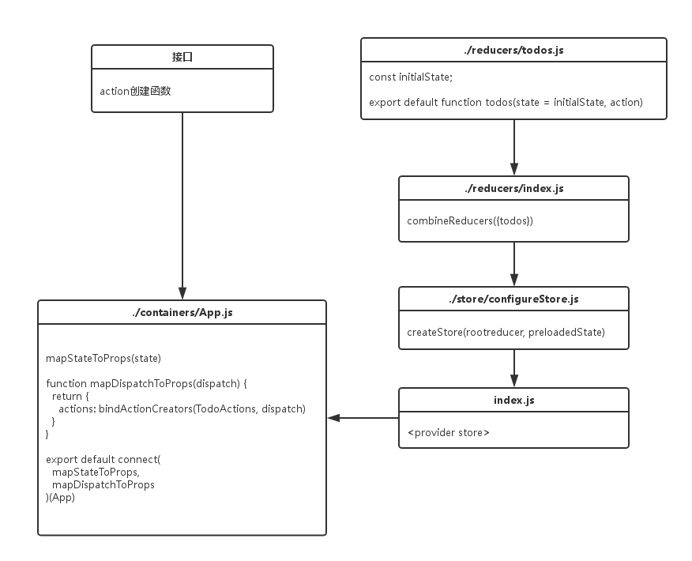

# redux学习

### connect函数

- connect 方法不会改变原来的组件类，反而返回一个新的 **已与 Redux store 连接的** 组件类。注意这里并没有注入`store` 对象，真正 `store` 对象的注入靠最后的<Provider store>组件；（更多说明请参考 [react-redux 的 API][1]）
- 传入 connect 的 mapStateToProps方法 ，正如其名，是将 Redux 的状态 映射到 React组件的props属性。任何时候，**只要 Redux store 发生改变，mapStateToProps 函数就会被调用**。这样确保 Redux 中的 state 发生改变时，组件都是最新的 Redux state。
- mapDispatchToProps方法 则是将 Store 中的 dispatch方法 直接封装成对象的一个属性，一般会用到 Redux 的辅助函数 [bindActionCreators()](http://camsong.github.io/redux-in-chinese/docs/api/bindActionCreators.html)；这里将 `dispatch` 绑定到 `action`属性，这样在红绿灯组件内让其变成红灯的时候，不需要 `dispatch(changeRed())` 这么调用，直接使用 `actions.changeRed()`，语义化更好；（更多说明请参考 [react-redux 的 API][1]）
- 最后的<Provider store>使组件层级中的**connect()**方法都能够获得**Redux store**，这里才真正注入`store`变量，之前的只是声明而已（之前的好比store是个形参，到了这一步store就是实参了）。（更多说明请参考 [react-redux 的 API][1]）

### 以todomvc为例

 